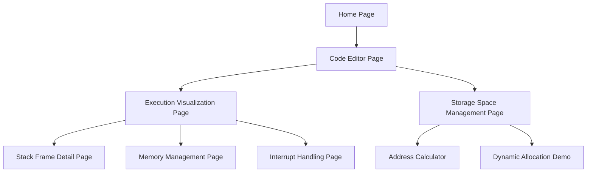

## 1. Product Overview

MIPS教学网页是一个交互式学习平台，帮助学生理解C语言到MIPS汇编代码的转换过程，以及程序执行时寄存器和内存状态的变化。该工具通过可视化展示函数调用栈关系、中断处理过程和MIPS存储空间管理，让计算机组成原理的教学更加直观易懂。

主要解决在学习MIPS汇编和计算机系统底层原理时的抽象概念理解困难，适用于高校计算机专业学生、爱好者和自学者，以纯访客形式提供轻量级、开箱即用的体验。

## 2. Core Features

### 2.1 User Roles

本项目采用无后端账户系统的轻量化设计：

| Role    | Registration Method | Core Permissions |
| ------- | ------------------- | ---------------- |
| Visitor | 无需注册（纯前端/无状态访问） | 浏览示例代码、执行C到MIPS转换、使用可视化演示功能 |

### 2.2 Feature Module

MIPS教学网页包含以下核心页面：

1. **代码编辑器页面**：C代码输入、MIPS代码生成、语法高亮显示。
2. **执行可视化页面**：寄存器状态、内存变化、栈帧结构、程序计数器跟踪。
3. **存储空间管理页面**：MIPS内存布局图、各段地址范围、动态内存分配演示。
4. **中断处理演示页面**：中断请求流程、ISR执行过程、返回机制动画。

### 2.3 Page Details

| Page Name | Module Name | Feature description             |
| --------- | ----------- | ------------------------------- |
| 代码编辑器页面   | C代码编辑器      | 支持C语言语法高亮、自动补全、错误提示。提供常见算法模板选择。 |
| 代码编辑器页面   | MIPS代码显示    | 实时显示对应的MIPS汇编代码，支持语法高亮和指令注释。    |
| 代码编辑器页面   | 转换控制面板      | 选择编译优化级别、显示/隐藏注释、导出汇编代码。        |
| 执行可视化页面   | 寄存器监控       | 实时显示32个通用寄存器值变化，支持十进制/十六进制切换。   |
| 执行可视化页面   | 内存视图        | 分区域显示代码段、数据段、堆、栈的内容，支持地址跳转。     |
| 执行可视化页面   | 栈帧可视化       | 图形化展示函数调用栈结构，显示参数传递、局部变量、返回地址。  |
| 执行可视化页面   | 执行控制        | 单步执行、断点设置、执行速度调节、重置程序。          |
| 存储空间管理页面  | 内存布局图       | 交互式MIPS内存映射图，显示各段起始地址和大小。       |
| 存储空间管理页面  | 地址计算器       | 输入逻辑地址计算物理地址，验证地址合法性。           |
| 存储空间管理页面  | 动态分配演示      | 模拟malloc/free过程，展示堆空间变化。        |
| 中断处理演示页面  | 中断流程图       | 动画演示中断请求、响应、处理、返回完整过程。          |
| 中断处理演示页面  | ISR代码查看     | 显示中断服务程序代码，支持单步执行观察。            |
| 中断处理演示页面  | 状态保存恢复      | 展示PC、状态寄存器保存和恢复过程。              |

## 3. Core Process

用户流程：访问首页 → 选择代码示例或输入C代码 → 查看生成的MIPS代码 → 进入执行可视化界面 → 单步执行观察寄存器和内存变化 → 查看函数调用栈变化 → 学习存储空间管理 → 理解中断处理机制。

## 4. User Interface Design

### 4.1 Design Style

* 主色调：深蓝色(#1e3a8a)搭配浅灰色(#f8fafc)背景

* 按钮样式：圆角矩形，主要操作使用渐变蓝色，次要操作使用灰色边框

* 字体：等宽字体用于代码显示(Consolas)，系统字体用于界面文本(Microsoft YaHei)

* 布局风格：左侧导航栏 + 右侧主内容区，支持标签页切换

* 图标风格：使用简洁的线性图标，重点操作使用彩色图标强调

### 4.2 Page Design Overview

| Page Name | Module Name | UI Elements                        |
| --------- | ----------- | ---------------------------------- |
| 代码编辑器页面   | C代码编辑器      | 深色主题，行号显示，语法高亮使用鲜明色彩区分关键字、变量、函数等   |
| 执行可视化页面   | 寄存器监控       | 32个寄存器以4x8网格排列，值变化时高亮显示，支持悬停查看详细信息 |
| 执行可视化页面   | 内存视图        | 垂直内存条，不同段使用不同颜色标识，支持缩放和地址跳转        |
| 栈帧可视化     | 栈结构图        | 自上而下显示栈增长方向，每个栈帧用边框区分，显示函数名和局部变量   |
| 存储空间管理    | 内存布局图       | 横向条形图显示各内存段，标注起始地址和大小，支持点击查看详情     |
| 中断处理演示    | 流程动画        | 使用箭头和时间线展示中断处理步骤，当前步骤高亮显示          |

### 4.3 Responsiveness

采用桌面端优先设计，主界面最小宽度1200px。在平板设备上自适应为单栏布局。触摸设备优化：增大按钮点击区域、支持手势缩放内存视图。

