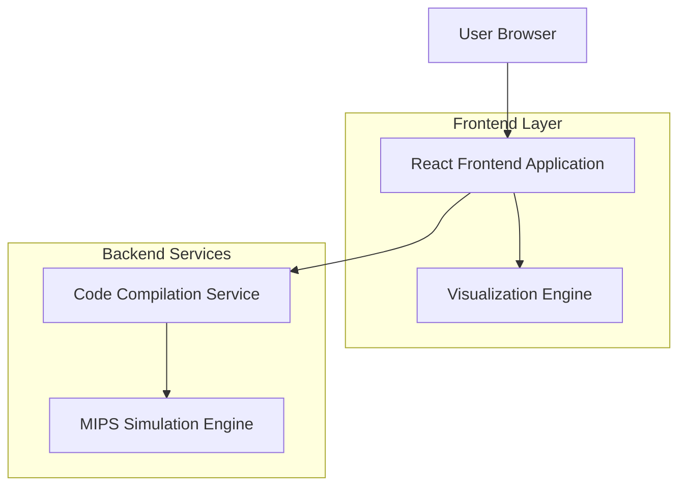
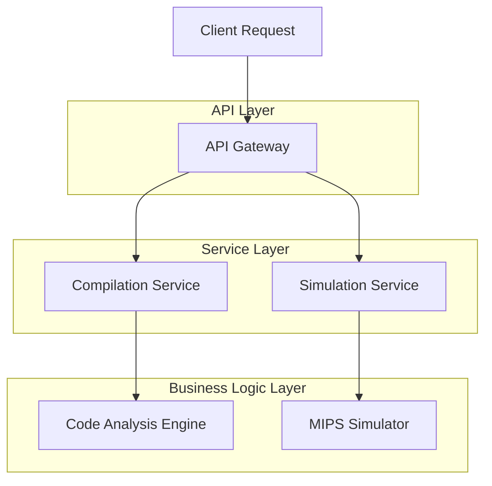

## 1. Architecture design



## 2. Technology Description

* Frontend: React\@18 + TypeScript\@5 + TailwindCSS\@3 + Vite

* Initialization Tool: vite-init

* Code Editor: Monaco Editor\@0.45 (VS Code核心编辑器)

* State Management: Zustand\@4 (轻量级状态管理)

* 2D Visualization: Canvas/SVG/TailwindCSS用于内存和栈帧可视化

## 3. Route definitions

| Route          | Purpose             |
| -------------- | ------------------- |
| /              | 首页，展示产品功能和快速入口      |
| /editor        | 代码编辑器页面，C到MIPS转换主界面 |
| /visualization | 执行可视化页面，寄存器和内存状态展示  |
| /memory        | 存储空间管理页面，内存布局和分析工具  |
| /interrupt     | 中断处理演示页面，中断机制动画展示   |

## 4. API definitions

### 4.1 Code Compilation API

```
POST /api/compile/c-to-mips
```

Request:

| Param Name          | Param Type | isRequired | Description          |
| ------------------- | ---------- | ---------- | -------------------- |
| source\_code        | string     | true       | C语言源代码               |
| optimization\_level | string     | false      | 优化级别 (-O0, -O1, -O2) |
| include\_debug      | boolean    | false      | 是否包含调试信息             |

Response:

| Param Name        | Param Type | Description |
| ----------------- | ---------- | ----------- |
| mips\_code        | string     | 生成的MIPS汇编代码 |
| compilation\_info | object     | 编译信息和警告     |
| error\_message    | string     | 错误信息（如果有）   |

### 4.2 Execution Simulation API

```
POST /api/simulate/execute-step
```

Request:

| Param Name      | Param Type | isRequired | Description |
| --------------- | ---------- | ---------- | ----------- |
| mips\_code      | string     | true       | MIPS汇编代码    |
| current\_step   | number     | true       | 当前执行步骤      |
| register\_state | object     | true       | 当前寄存器状态     |
| memory\_state   | object     | true       | 当前内存状态      |

Response:

| Param Name        | Param Type | Description |
| ----------------- | ---------- | ----------- |
| next\_step        | number     | 下一步编号       |
| register\_changes | object     | 寄存器变化       |
| memory\_changes   | object     | 内存变化        |
| stack\_frame      | object     | 栈帧信息        |
| is\_complete      | boolean    | 是否执行完成      |

## 5. Server architecture diagram



